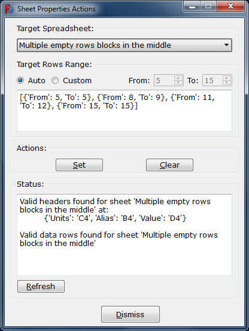

# Spreadsheet Cells Properties Actions

## 1. About

This Macro helps performing actions (e.g., set, clear) on cells properties
of FreeCAD spreadsheet.

Setting cell properties is based on visible data in respective columns of the
same spreadsheet.

The data source columns for the cells properties (i.e., Alias, Units), as
well as the target column (i.e., Value), need to have appropriate headers.

These columns with their headers (i.e., Alias, Units, Value) can be included
in the spreadsheet in any order and in any column position, as long as each
header with its respective data are given in the same column.

The headers can be placed at any row, as long as all the headers are on the
same row. The target column header (i.e., Value) is mandatory, the headers
for the data source columns for the cells properties (i.e., Alias, Units) can
be configured each as mandatory or optional.

Empty rows can be placed anywhere, including inside the range occupied by
the cells of these columns with their headers (i.e., Alias, Units, Value).

Missing or invalid source data for the cells properties are ignored.

Additional data (e.g., comments, description, tabular data) can be placed
above or below the range occupied by the cells of these columns with their
headers (i.e., Alias, Units, Value).

Additional columns can be placed to the left, right, or between these columns
with their headers. This additional data may freely include any name of the
headers, as long as it is part of a longer text.

The location of the headers, and the starting and ending rows of the range of
these columns are discovered automatically after the target spreadsheet is
selected. The user may however, limit this range if it is desired so.

The Macro supports multiple spreadsheets included in a single document. It
allows selecting the target spreadsheet using a ComboBox (aka, pop-up menu),
or from the tree view. Both methods of selecting a target spreadsheet can be
used interchangeably. The Macro syncs between the tree view selection and
the ComboBox, bi-directionally.

## 2. Disclaimer of warranties and limitation of liability

Use at your own risk. The author assumes no liability for data loss.
It is advised to backup your data frequently.

Copyright (c) 2017 - 2018, Uri Benchetrit, <uribench@gmail.com>.
All rights reserved.

## 3. License

This work is licensed under GNU Lesser General Public License (LGPL).  
License details:  https://www.gnu.org/licenses/lgpl-3.0.html

## 4. Gist of this Macro

The ActiveDocumentSheets class holds the context of this Macro. It maintains 
information about the active document, such as a list of all the available 
spreadsheets, useful document level constants (e.g., header names for common 
columns), and useful maps (e.g., from spreadsheet label to spreadsheet object 
reference). One instance of ActiveDocumentSheets is needed for this Macro and 
it should not have any spreadsheet specific information.

The RequestParameters class holds spreadsheet specific information. This 
includes for instance, the location of the common columns, the ranges of usable 
data source rows. One instance is created for every spreadsheet found in the 
active document. The RequestParameters has to be ready with all of its 
information prior to performing any action on the associated spreadsheet.

The SheetPropertiesActions class provides the possible actions on a spreadsheet 
(e.g., setting and clearing cell properties). It requires a concrete 
RequestParameters instance prior to performing any of its actions.

The SheetPropertiesActionsForm is one way of consuming the above. When the 
SheetPropertiesActionsForm is instantiated, all the RequestParameters instances 
of all the sheets found for the active document, have been set to reflect the 
current state of the sheets. The SheetPropertiesActionsForm allows selecting 
interactively one spreadsheet from the list of known spreadsheets of the active 
document, identify the appropriate RequestParameters and pass it to the respective 
SheetPropertiesActions. However, RequestParameters and SheetPropertiesActions can 
be set and consumed without using a GUI.

## 5. Examples

The above main dialog of the **SheetProperties** Macro refers to the following FreeCAD spreadsheet example:

In the above example, the spreadsheet includes several comment rows at the beginning, followed by an empty row and then the headers line, and finally the main data rows with multiple empty rows left intentionally here and there.

The **SheetProperties** Macro automatically identified the row location of the headers, as well as the ranges of the source data for setting the properties of the relevant cells under the Value header column. These discovered ranges are displayed in the above main dialog.

For more examples (both valid and invalid examples) see: test/TestAll-SheetProperties.FCStd